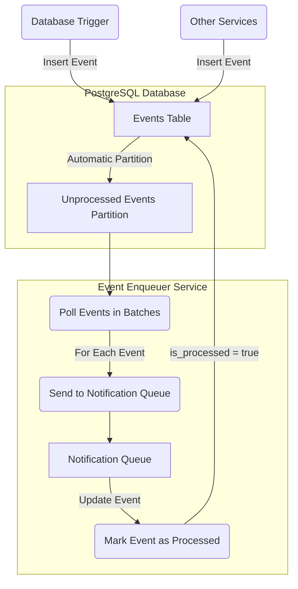

## Event Processing Flow



## Flow Overview

This flow describes how events are processed in the system:

1. **Event Creation**: Events are inserted into the database either via database triggers or external service calls.

2. **Partitioning Events**: Once inserted, events are automatically routed into the appropriate partition based on whether they are processed or not. Unprocessed events are stored in a dedicated partition for efficient querying.

3. **Event Enqueuer Service**: This service periodically polls unprocessed events in batches, ordered by their `created_at` timestamp. For each event:
    - It is sent to a RabbitMQ notification queue for further processing by downstream systems.
    - The event is then marked as processed in the database by updating the `is_processed` flag.

4. **Updating Events**: After successful notification, the event is updated in the database to prevent reprocessing.


---

## Proposed Tables

### 1. **Event Type Table**

```sql
CREATE TABLE IF NOT EXISTS event_type (
    id UUID NOT NULL DEFAULT gen_random_uuid() PRIMARY KEY,
    name TEXT NOT NULL UNIQUE,
    reference_table TEXT,
    description TEXT
);
```

| Column Name       | Data Type | Description                                     |
|-------------------|-----------|-------------------------------------------------|
| `id`              | UUID      | Unique identifier for the event type.           |
| `name`            | TEXT      | Name of the event type (must be unique).       |
| `reference_table` | TEXT      | Name of the table that has the `reference_id` in the **Event Table**. |
| `description`     | TEXT      | Description of the event type.                  |

### 2. **Event Table**

```sql
CREATE TABLE IF NOT EXISTS event (
    id UUID NOT NULL DEFAULT gen_random_uuid(),
    reference_id UUID,
    tenant_id UUID NOT NULL,
    type_id UUID NOT NULL REFERENCES event_type(id),
    payload JSONB NOT NULL,
    header JSONB,
    is_processed BOOLEAN DEFAULT FALSE,
    created_at TIMESTAMP DEFAULT CURRENT_TIMESTAMP
) PARTITION BY LIST (is_processed);
```

| Column Name       | Data Type | Description                                       |
|-------------------|-----------|---------------------------------------------------|
| `id`              | UUID      | Unique identifier for the event.                  |
| `reference_id`    | UUID      | Optional reference to link events to external entities. |
| `tenant_id`       | UUID      | Identifier for the tenant associated with the event. |
| `type_id`         | UUID      | Foreign key referencing the `event_type` table.   |
| `payload`         | JSONB     | Contains the event data in JSON format.           |
| `header`          | JSONB     | Contains metadata about the event.                 |
| `is_processed`    | BOOLEAN   | Indicates whether the event has been processed.    |
| `created_at`      | TIMESTAMP | Timestamp when the event was created.              |

### 3. **Indexing**

```sql
CREATE INDEX IF NOT EXISTS idx_events_created_at ON event(created_at);
CREATE INDEX IF NOT EXISTS idx_events_reference_id ON event(reference_id);
```

| Index Name                  | Columns                  | Description                                                  |
|-----------------------------|-------------------------|--------------------------------------------------------------|
| `idx_events_created_at`     | `created_at`            | Index for optimizing queries based on the creation timestamp. |
| `idx_events_reference_id`    | `reference_id`          | Index for optimizing lookups by reference ID.                |

### 4. **Partitioning**

```sql
CREATE TABLE IF NOT EXISTS events_unprocessed PARTITION OF event
    FOR VALUES IN (FALSE);

CREATE TABLE IF NOT EXISTS events_processed PARTITION OF event
    FOR VALUES IN (TRUE);
```

| Partition Name              | Condition                | Description                                                  |
|-----------------------------|--------------------------|--------------------------------------------------------------|
| `events_unprocessed`        | `is_processed = FALSE`   | Stores unprocessed events for efficient querying.           |
| `events_processed`          | `is_processed = TRUE`    | Stores processed events, allowing for easier management.    |

### 5. **Event Processing and Partitioning Behavior**
When an event is updated and marked as processed (`is_processed = true`), PostgreSQL automatically moves it from
the `events_unprocessed` partition to the `events_processed` partition. This ensures efficient data management and 
query performance as the system scales.


## Design Decisions

### 1. **Partitioning Based on `is_processed`**

Partitioning the event table by the `is_processed` flag provides performance benefits:

- **Query Optimization**: Polling for unprocessed events only involves scanning the unprocessed partition, avoiding unnecessary reads of processed events. This improves performance, especially as the number of processed events grows over time.
- **Data Management**: With partitions, it is easier to manage large volumes of events. For instance, processed events can be archived or moved to cold storage while keeping active partitions small and efficient for querying.

### 2. **Choosing JSONB for `payload` and `header`**

The `payload` and `header` fields are stored as `JSONB` due to the flexibility and future-proofing it offers:

- **Flexibility**: By using `JSONB`, we can store different event types within the same table, making it simpler to handle various event data formats.
- **Schema Changes**: Since event structures may need to change (e.g., adding new fields), storing the payload as `JSONB` ensures that new fields can be added without altering the table schema. This minimizes downtime and disruption.
- **Versioning and Metadata in Header**: The `header` stores metadata, such as the version of the payload and additional information like a tracing ID. This allows for version control and ensures backward compatibility, meaning older versions of events can still be processed correctly.

### 3. **Having a `reference_id`**

Adding a `reference_id` allows us to link events to specific external entities, making it easier to track all events related to a specific transaction or domain.

---
