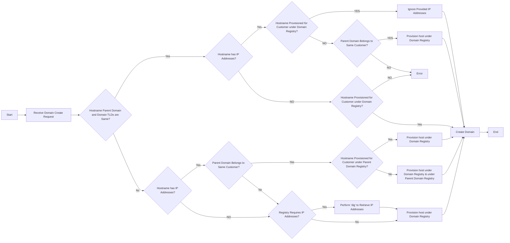

```mermaid

graph LR
    A[Start] --> B[Receive Domain Create Request]
    B --> C{Hostname Parent Domain and Domain TLDs are Same?}
    C --> |Yes| D{Hostname has IP Addresses?}
    C --> |No| E{Hostname has IP Addresses?}

    D --> |Yes| F{Hostname Provisioned for Customer under Domain Registry?}
    D --> |NO| G{Hostname Provisioned for Customer under Domain Registry?}

    F --> |YES| H[Ignore Provided IP Addresses] --> Y
    F --> |NO| K{Parent Domain Belongs to Same Customer?}

    G --> |NO| X
    G --> |Yes| Y

    K --> |YES| L[Provision host under Domain Registry] --> Y
    K --> |NO| X

    E --> |Yes| M{Parent Domain Belongs to Same Customer?}
    E --> |NO| N{Registry Requires IP Addresses?}

    M --> |Yes| O{Hostname Provisioned for Customer under Parent Domain Registry?}
    M --> |No| N

    N -->|Yes| Q[Perform 'dig' to Retrieve IP Addresses] --> W
    N -->|No| W

    O --> |Yes| R[Provision host under Domain Registry] --> Y
    O --> |No| S[Provision host under Domain Registry & under Parent Domain Registry] --> Y

    W[Provision host under Domain Registry] --> Y

    X[Error]
    Y[Create Domain] --> Z
    Z[End]

```
