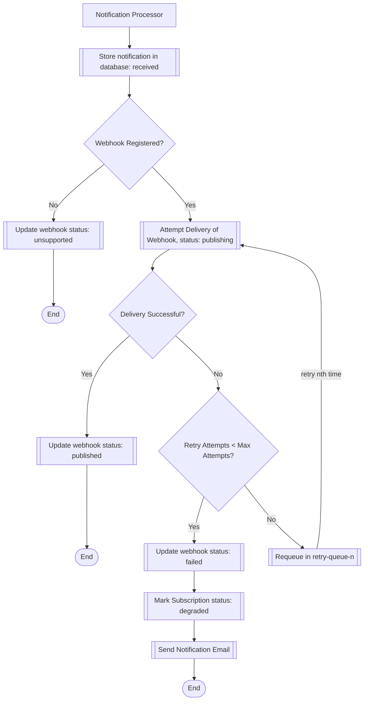

# Subscription Notification Processing Flow

## Modules Documentation

- [Template](template/README.md): This module defines the database structure for managing templates and their related entities.
