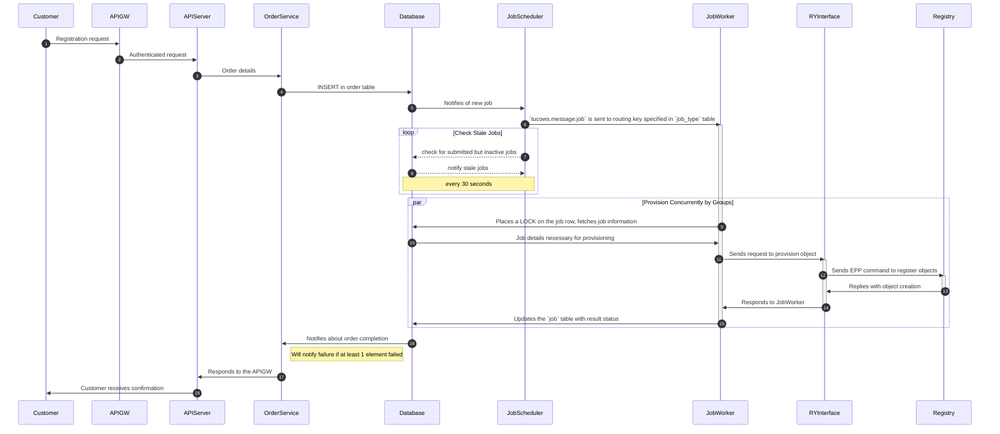
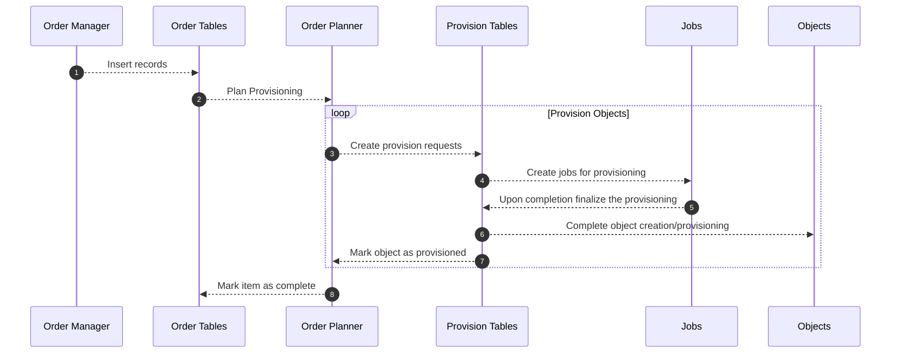

# Domains Database

## Configuration

The common PostgresSQL configuration is stored in the shared [postgresql.conf](etc/postgresql.conf).

It defines the default database for `pg_cron` as `tdpdb`.
In order to configure a different database for `pg_cron`, you can add `cron.conf` file to the same directory with `postgresql.conf`.

## Local setup

### Local setup Windows

1. Install Docker from https://www.docker.com/products/docker-desktop/. Docker Compose will be install automatically with Docker. You can check version of Docker Compose by selecting 'About Docker Desktop' from the Docker menu.

2. Install Ubuntu on WSL2 https://ubuntu.com/tutorials/install-ubuntu-on-wsl2-on-windows-10#1-overview & follow the instructions.

3. Install Windows Terminal from https://apps.microsoft.com/detail/9N0DX20HK701?hl=ar-so&gl=SO

4. Clone the folder 'tdp-database-design' from https://github.com/tucowsinc/tdp-database-design to local computer.

5. Open Windows Terminal and select Ubuntu terminal.

6. Install PostgreSQL-client: $ sudo apt-get install -y postgresql-client

7. Change directory to 'tdp-database-design' and execute: $ make all

8. Connect to database tdpdb: $ psql -h localhost -d tdpdb -U tucows
   Password: tucows1234

### Local setup Mac

1. Install Docker from https://www.docker.com/products/docker-desktop/. Docker Compose will be installed automatically with Docker. You can check the version of Docker Compose by selecting 'About Docker Desktop' from the Docker menu.

2. Install Homebrew by following the instructions at https://brew.sh/.

3. Open Terminal and run the following command to install PostgreSQL:

   ```
   brew install postgresql
   ```

4. Start the PostgreSQL server by running the following command:

   ```
   brew services start postgresql
   ```

5. Clone the folder 'tdp-database-design' from https://github.com/tucowsinc/tdp-database-design to your local computer.

6. Change directory to 'tdp-database-design' and execute:

   ```
   make all
   ```

7. Connect to the database tdpdb:

   ```
   psql -h localhost -d tdpdb -U tucows
   ```

   Password: tucows1234

## Order Processing



## Order workflow



## DBeaever Grafical User Interface for DB \*\*

DBeaver Community is a free cross-platform database tool for developers, database administrators, analysts, and everyone working with data. It supports all popular SQL databases like MySQL, MariaDB, PostgreSQL, SQLite, Apache Family, and more.

### Installation Mac

Download appropriate package (.dmg) from https://dbeaver.io/download/ & follow the instructions.

## Migration

Database migration is done by script which can be run manually. The script link is [script/run-migrations](script/run-migrations).
A database directory where `migrations` directory exists can be provided as `DIR` environment variable.

It goes over all migration files under `migrations` directory in `db` folder and executes it unless already recorded in `migration` table.

Postgres credentials are stored in 1pass "TDP (New Platform)" vault. The script will prompt you to provide database credentials. Make sure to checkout right branch which matches corresponding release.

For [tdpdb](tdpdb) migrations, run:

```bash
cd db

PSQL="psql -X -q --single-transaction" \
PGHOST=ascdomaindb01.dev-tucows-domains.cnco.tucows.systems \
PGDATABASE=tdpdb \
PGPORT=5432 \
../script/run-migrations tdpdb vX.X.X
```

- Replace vX.X.X with the migration version you are applying (should match release version).

### Using `make migrate`

You can use the `make migrate` command. It allows you to specify the migration version argument:

```bash
make migrate VERSION=<VERSION_NUMBER>
```

For example:

```bash
make migrate VERSION=v1.0.2
```

For Dev database `ascdomaindb01.dev-tucows-domains.cnco.tucows.systems` schema changes 
result in tables not being accessible by application user. This can be fixed by running following SQL commands.


```bash
psql -U <username> -h ascdomaindb01.dev-tucows-domains.cnco.tucows.systems -p 5432

GRANT ALL PRIVILEGES ON ALL TABLES IN SCHEMA public TO ordermanager_service;
GRANT ALL PRIVILEGES ON ALL TABLES IN SCHEMA public TO ordermanager_service_role;
GRANT USAGE ON SEQUENCE audit_trail_log_id_seq TO ordermanager_service;
```

Provide **password** for `<username>` user when prompted.

## Connecting to AWS Database

TDP databases are located in AWS accounts for given environments and requires SSH tunnel setup. All secrets are in "TDP (New Platform)" 1pass vault

1. Create file with above private key (ex: ~/awsbastion/tdpqa). See aws "tdp bastion-host" key in Vault.

   ```bash
   sudo chmod 600 ~/awsbastion/tdpqa
   ```

2. Create ssh tunnel

   ```bash
   ssh -N -i ~/awsbastion/tdpqa -L 9009:tdp-qa-rds-cluster.cluster-cm7lyqwhpmgu.us-east-1.rds.amazonaws.com:5432 ec2-user@ec2-3-88-143-33.compute-1.
   amazonaws.com
   ```

3. Database will be available on localhost:9009
4. For credentials see "AWS TDP DB" key in Vault

## Migration Notes

> When working with migration files that involve tables inheriting from either `class.provision` or `class.audit_trail`,
> it is crucial to include these trigger files to your migration `provisioning/triggers.ddl` or `triggers.ddl`.

> These files generate essential triggers for tables inheriting from the mentioned classes. Therefore, any table inheriting
> from `class.provision` must include triggers from `provisioning/triggers.ddl`, and similarly, tables inheriting from `class.audit_trail` must include triggers from `triggers.ddl`.

-- AVOID ERRORS:

> CREATE TABLE IF NOT EXISTS name (...);

> DROP TABLE IF EXISTS name;

> CREATE OR REPLACE FUNCTION name() ...

> CREATE INDEX ON name;

> CREATE OR REPLACE TRIGGER name ...

> CREATE OR REPLACE VIEW ...

> DROP MATERIALIZED VIEsW IF EXISTS name...
> CREATE MATERIALIZED VIEW ...

> INSERT INTO name (col1, col2) VALUES ... ON CONFLICT DO NOTHING;

> ALTER TABLE name ADD COLUMN IF NOT EXISTS col1 TYPE;

## HowTo Create Test File

Assume you work in brunch feature/TDP-XXXX/xxxxxx on module xxxxx; Create folder db/t/xxxxx.

In there create file xxxx.pg.

In this test file the following should be present:

1.  BEGIN;
2.  Start testing: SELECT \* FROM no_plan().
3.  Check presence of schema, tables, functions.
4.  If needed check presence of columns.
5.  Write test for each function for each outcome and compare it with predicted values.
6.  Finish testing: SELECT \* FROM finish(TRUE);
7.  ROLLBACK;

## HowTo Test Migrations

switch to base branch (for example develop) and build DB

```bash
git checkout develop
make all
```

switch to feature branch, change directory to db and execute migration

```bash
cd db

PSQL="psql -X -q --single-transaction" PGHOST=localhost PGDATABASE=tdpdb PGPORT=5432 PGUSER=tucows PGPASSWORD=tucows1234 ../script/run-migrations tdpdb v0.0.0

cd ..

make test
```

where v0.0.0 can be any number - it is not important;

## Debugging Queries Locally

To debug query performance and execution flow locally, you can use the `pg_stat_statements` and `auto_explain` extensions.

#### 1. Configure PostgreSQL

Modify your `etc/postgresql.conf` file to enable these extensions:

- Add `auto_explain` to `shared_preload_libraries`:

  ```ini
  shared_preload_libraries = 'pg_cron,pg_stat_statements,auto_explain'
  ```

- Set the following parameters (you can adjust values as needed):

  ```ini
  pg_stat_statements.track = all
  auto_explain.log_triggers = on
  auto_explain.log_min_duration = 20
  auto_explain.log_analyze = on
  auto_explain.log_nested_statements = on
  ```

#### 2. Restart and Rebuild the Database

After updating the configuration, restart PostgreSQL and rebuild the database if necessary.

#### 3. Run the Queries You Want to Debug

Execute the specific queries or operations you need to analyze.

#### 4. Enable and Use `pg_stat_statements`

- Ensure the extension is enabled in your database:

  ```sql
  CREATE EXTENSION IF NOT EXISTS pg_stat_statements;
  ```

- Retrieve a list of slow queries:

  ```sql
  SELECT query,
         mean_exec_time,
         calls,
         min_exec_time,
         max_exec_time,
         total_exec_time
  FROM pg_stat_statements
  ORDER BY mean_exec_time DESC
  LIMIT 100;
  ```

- Reset statistics when needed:

  ```sql
  SELECT pg_stat_statements_reset();
  ```

#### 5. Analyze Query Execution with `auto_explain`

With `auto_explain` enabled, all queries exceeding `log_min_duration` will have their execution plans logged, including trigger execution times. Check your PostgreSQL logs for detailed query execution insights.

## HowTo Run tests

### Prerequisites

Run and load data for databases

```bash
make stop & make
```

### Main TDP Database tests

To test the tdp database, run the following command:

```bash
make test
```

#### Finance tests

To load and test the finance-data target, run the following command:

```bash
make test-finance-data
```
