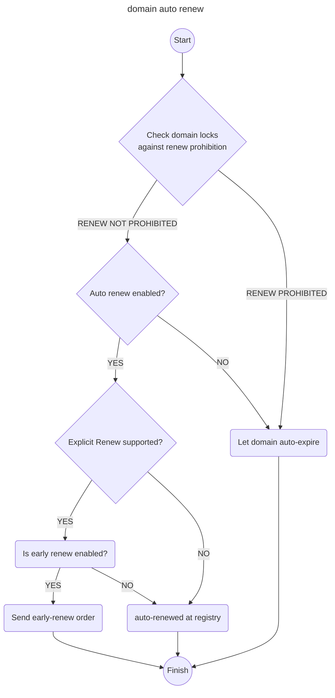
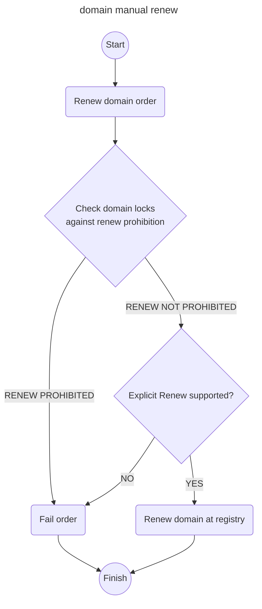

# Domain Renewal Process

This document describes the process for Renewal Mode and Auto-X Behavior.

## Auto renew 
**After discussion, we've decided to proceed with a single boolean flag named "auto_renew" to represent the renewal mode. Early renewal will be handled internally at a later stage.**
```json
{
    "name": "example.com",
    "auto_renew": true,             <--------
}
```
---

### Summary
- There are two options to represent auto-renewal:
    - A single string flag named "renewal_mode" with three options: "auto-renew", "early-renew", and "auto-expire".
    - Two separate boolean flags: "auto_renew" and "early_renew".
- These flags, along with the explicit_renew_supported TLD setting, will be used internally to determine the renewal mode.
- Whether explicit renewal is allowed or not depends on the registry/TLD.


### API
#### Request
> single flag
```json
{
    "name": "example.com",
    "renewal_mode": "early-renew",  <--------
}
```
---
> two flags
```json
{
    "name": "example.com",
    "auto_renew": true,             <--------
    "early_renew": true             <--------
}
```

## Database flow
Step for domain renewal upon expiration date:
1. **Check for Expiration**: The system determines if the domain is close to its expiration date.
2. **Is renew prohibited?**:
    * **Yes**: Domain is left to **auto-expire**
    * **No**:  Proceed to step 3
3. **Is auto renew enabled?**:
    * **Yes**: Proceed to step 4.
    * **No**: Domain is left to **auto-expire**
4. **Is explicit renew supported?**:
    * **Yes**: Proceed to step 5.
    * **No**: **Auto-renew** is done at registry
5. **Is early renew enabled?**:
    * **Yes**: An automated **early-renew** order is sent to registry.
    * **No**: **Auto-renew** is done at registry

OR as a flowchart:



## Manual renew 
User have the option to renew domain manually regardless of the auto_renew value.
This would renew the domain in the registry if explicit renew is allowed.

