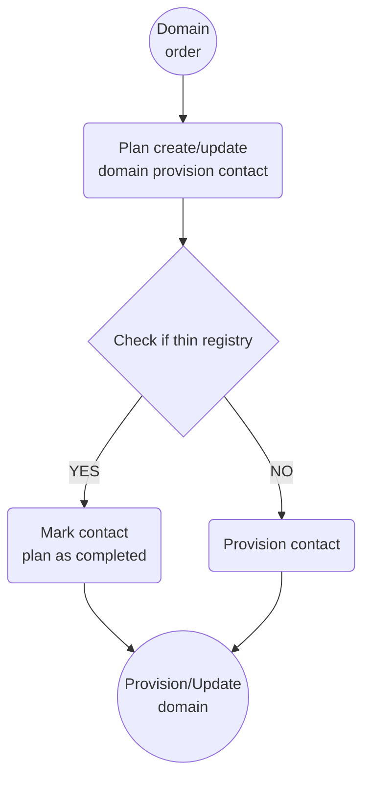

# Thin registry

## Summry
- Thin tlds do have contacts, but these are handled by the registrars and not passed to the registry.
- Required contacts are based on the tld settings.
- Client update lock should prevent update on the contacts.
- Owner change is done in the registrar not in the registry.

## Handling thin registries options:
1. IF condition checking tld configs in the existing stored procedures
    - Pros:
        - All contact logic in one place.
        - Handles all providers.
    - Cons:
        - Can become complex and convoluted with multiple conditions.

2. Triggers on plan tables to check against tld settings
    - Pros:
        - Separation of concerns.
        - Handles all providers.
    - Cons
        - Trigger conditions can become complex.

3. Provider specific strategy in order_item_strategy table
    - Pros:
        - Separation of concerns.
        - Flexible flow
    - Cons:
        - Must be implemented for each thin provider.
        - May lead to duplication of code.

**After discussion, we've decided to proceed with using TLD setting to represent thin/thick registry, and check against that in plan_create_domain_provision_contact/plan_update_domain_provision_contact stored procedure** 

## Domain create/update database flow
> For thin registry we skip the provision part for the contact and mark that as complete. The rest of the the flow remains as is.

